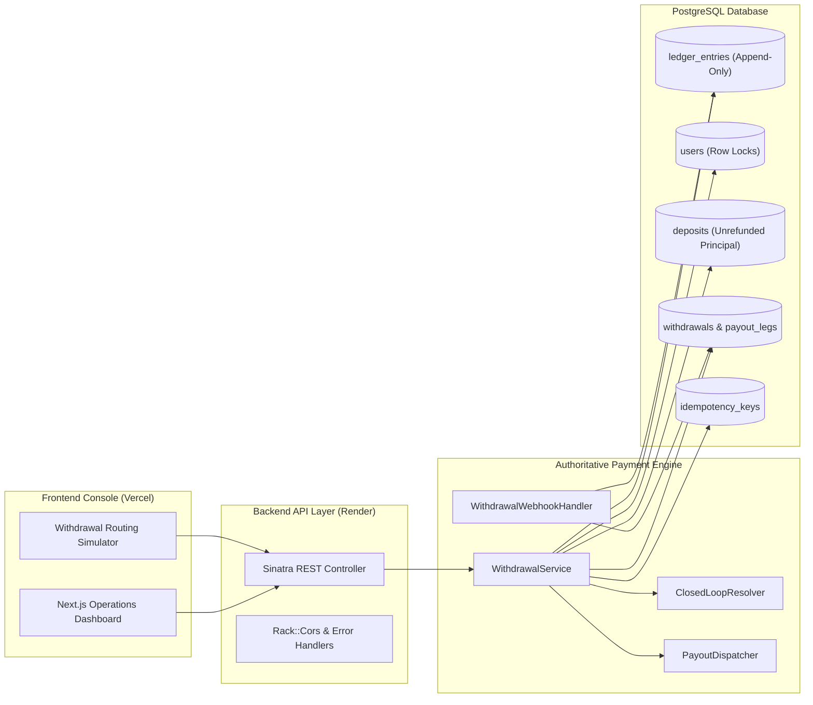

# SOAP Payments — Closed-Loop Withdrawal Router

An enterprise-grade payments orchestration platform and operations console built with **Next.js 16 (App Router)**, **Ruby/Sinatra**, and **PostgreSQL**. Features deterministic Anti-Money Laundering (AML) closed-loop routing, pessimistic concurrency control, database-backed idempotency, an append-only double-entry ledger, and a real-time visual Withdrawal Routing Simulator.

---

## Live Demo & Architecture

| Component | Target Environment | Local URL | Deployment Architecture |
| :--- | :--- | :--- | :--- |
| **Public Landing Page** | Vercel (Next.js 16) | `http://localhost:3000/` | Public architectural overview & live demo entrance |
| **Frontend Operations Console** | Vercel (Next.js 16) | `http://localhost:3000/overview` | Responsive operations dashboard & simulator |
| **Backend API Layer** | Render (Puma / Sinatra) | `http://localhost:4567` | Lightweight REST API Adapter with security guards |
| **Domain Engine** | Ruby 3.3 / ActiveRecord | In-process | Core Orchestration & Financial Invariants |
| **Database** | PostgreSQL | `localhost:5432` / `5433` | Append-Only Financial Ledger & Relational Models |



---

## Core Payment Invariants

The platform strictly enforces the following financial and operational rules:

1. **FIFO Closed-Loop Routing:** Payouts first refund prior deposits back to their originating payment instruments in FIFO order (by settlement timestamp) before any residual excess is routed to a default payout method.
2. **Asset Family Isolation:** Crossing asset families (e.g. fiat card/ACH vs. cryptocurrency) is refused to prevent unauthorized currency conversions or routing anomalies.
3. **Pessimistic Concurrency Control:** Withdrawals acquire a database row lock (`FOR UPDATE`) on the user balance record, preventing balance overdrafts under concurrent requests.
4. **Database-Backed Idempotency:** Requests with the same key and payload return cached results without duplicate side effects. Mismatched payloads return `409 Conflict`.
5. **Decoupled Payout Dispatch:** External network calls to payout providers occur **outside** the database transaction lock, protecting DB connection pools from third-party latency.
6. **Provider Failure Compensation:** Definite payout failures execute an exact-once compensating ledger reversal, restoring the user's balance.
7. **Ambiguous Outcome Safety:** Provider timeouts or `:unknown` outcomes remain non-terminal without automatic retry or premature reversal, awaiting async webhook reconciliation.
8. **Replay-Safe Webhooks:** Inbound webhook deliveries deduplicate on `external_event_id`. Duplicate callbacks exit as idempotent no-ops.
9. **Late Failure Protection:** If a payout leg is already settled, subsequent late failure callbacks are safely ignored without reversing funds.
10. **Immutable Append-Only Ledger:** All balance movements write signed deltas (`amount_cents`) to `ledger_entries`. Updates and deletions are blocked at the model layer:
    $$\text{User Balance} = \sum(\text{Ledger Entry Deltas})$$

---

## Frontend Operations Console

The frontend dashboard provides a light-theme, enterprise fintech operations experience (inspired by Stripe, Mercury, and Brex):

- **Overview (`/overview`):**
  - KPI Cards: Total Withdrawal Volume, Total Withdrawals, Success Rate, and Ledger Balance verification.
  - 7-Day Withdrawal Trends bar chart with hover tooltips and outcome distribution donut.
  - Live system component health monitor (Router, Dispatcher, Ledger, Webhook, Database).
  - Recent routing operations feed.
- **Withdrawal Routing Simulator (`/withdrawals/simulate`):**
  - Interactive test harness for closed-loop FIFO routing.
  - Customer selection (e.g. Aarav Mehta with 3 card deposits and 1 ACH payout method).
  - Configurable amount with integer minor unit validation.
  - Visual closed-loop routing diagram connecting original instruments to allocated payout legs.
  - API Request Inspector with copyable `curl` and JSON payloads.
  - Developer sandbox controls to simulate provider success, failure, and unknown outcomes.
- **Withdrawal Detail (`/withdrawals/:id`):**
  - Two-column enterprise view: Operational details (Legs, Event Timeline, Webhooks, Ledger entries) and static metadata.
- **Append-Only Ledger (`/ledger`):**
  - Live mathematical reconciliation banner verifying that total account balances equal the net sum of ledger transactions.
  - Signed transaction audit trail (red `-` for debits, green `+` for credits/reversals).
- **Webhook Monitor (`/webhooks`):**
  - Inbound event inbox with payload inspector, related leg references, and replay-safe deduplication badges.
  - Interactive test webhook emitter.
- **Developer API Explorer (`/developers`):**
  - Interactive "Try Request" console executing live requests against the backend.
  - Complete endpoint documentation with HTTP status codes (`200`, `201`, `400`, `403`, `409`, `422`, `500`).
- **Command Palette (`Cmd+K` / `Ctrl+K`):**
  - Instant keyboard navigation across all operational entities and pages.

---

## Backend API Specification

All endpoints return standard JSON envelopes. Error responses follow a uniform shape:
```json
{
  "error": {
    "code": "insufficient_funds",
    "message": "Insufficient funds"
  }
}
```

| Method | Endpoint | Description | Status Codes |
| :--- | :--- | :--- | :---: |
| `GET` | `/api/health` | Service health and database connection status | `200` |
| `GET` | `/api/dashboard` | Aggregated KPIs, 7-day trends, outcome distribution | `200` |
| `GET` | `/api/users` | List of customers, balances, and instrument counts | `200` |
| `GET` | `/api/users/:id` | Customer profile, deposits, and ledger summary | `200`, `404` |
| `GET` | `/api/payment-methods` | Masked payment instruments list | `200` |
| `GET` | `/api/withdrawals` | Filterable withdrawals list | `200` |
| `GET` | `/api/withdrawals/:id` | Withdrawal details, payout legs, and event timeline | `200`, `404` |
| `GET` | `/api/withdrawals/:id/ledger` | Related ledger audit trail entries for withdrawal | `200`, `404` |
| `GET` | `/api/withdrawals/:id/webhooks` | Related provider webhook events for withdrawal legs | `200`, `404` |
| `POST` | `/api/withdrawals` | Orchestrates a withdrawal via `WithdrawalService` | `201`, `400`, `403`, `409`, `422` |
| `GET` | `/api/ledger` | Immutable financial ledger and reconciliation status | `200` |
| `GET` | `/api/webhooks` | Webhook delivery history and replay-safety state | `200` |
| `POST` | `/api/webhooks` | Ingests and processes provider callbacks | `200` |
| `GET` | `/api/audit-logs` | Operational activity trail | `200` |

---

## Local Development Runbook

### Prerequisites
- **Ruby:** 3.3.x
- **Node.js:** 20.x or 24.x
- **PostgreSQL:** 15+
- **Bundler:** 2.5+

### 1. Database & Backend Setup
```bash
# Install Ruby gems
bundle install

# Run database migrations
bundle exec rake db:migrate

# Seed deterministic sandbox data
bundle exec rake db:seed

# Run the complete test suite (25 domain specs + 8 API specs)
bundle exec rspec

# Start the Puma API server on port 4567
bundle exec puma -p 4567 config.ru
```

### 2. Frontend Setup
```bash
cd frontend

# Install Node dependencies
npm install

# Start Next.js development server on port 3000
npm run dev

# Or build and run the production bundle
npm run build
npm run start
```

Open [http://localhost:3000](http://localhost:3000) in your browser to view the **Public Architectural Landing Page**, or navigate directly to [http://localhost:3000/overview](http://localhost:3000/overview) for the **Operations Console**.

---

## Automated Acceptance Matrix

The core implementation is thoroughly validated by a **47-example RSpec test suite** covering domain invariants, pessimistic concurrency, API contracts, security controls, pagination, and search:

| Scenario / Spec | Invariant Tested | Status |
| :--- | :--- | :---: |
| **R1** | Single deposit refunded FIFO to original instrument | PASS |
| **R2** | Oldest deposit fully exhausted before next deposit is allocated | PASS |
| **R3** | Residual excess routed to default payout method | PASS |
| **R4** | Refusal of cross-asset combinations (fiat ↔ crypto) | PASS |
| **R5** | Payout method owned by another user rejected | PASS |
| **R6** | Non-positive, float, or string amounts rejected | PASS |
| **R7** | Idempotent replay returns cached result with zero duplicate financial side effects | PASS |
| **R8** | Idempotency conflict on parameter mismatch returns 409 error | PASS |
| **R9** | Multithreaded concurrency: parallel threads cannot overdraft balance | PASS |
| **R10** | Provider `:submitted` updates state without ledger reversal | PASS |
| **R11** | Provider `:failed` executes exactly-once reversal restoring balance | PASS |
| **R12** | Provider `:unknown` leaves leg non-terminal with no reversal and no retry | PASS |
| **R13** | Duplicate webhook event delivery is an idempotent no-op | PASS |
| **R14** | Late failure webhook after settlement does not reverse funds | PASS |
| **R15** | Mathematical reconciliation between balance and ledger deltas | PASS |
| **R16** | Strict ledger immutability blocking update and delete | PASS |
| **API 1–2** | `/api/health` returns healthy status, DB check, and environment metadata | PASS |
| **API 3** | `/api/dashboard` derives consistent metrics from database | PASS |
| **API 4** | `POST /api/withdrawals` executes multi-leg closed-loop allocation | PASS |
| **API 5** | `POST /api/withdrawals` returns 409 on idempotency conflict | PASS |
| **API 6** | `POST /api/withdrawals` returns 422 on insufficient balance | PASS |
| **API 7** | `POST /api/withdrawals` handles simulated provider failure and reversal | PASS |
| **API 8** | `GET /api/ledger` verifies mathematical reconciliation | PASS |
| **API 9** | `POST /api/webhooks` handles asynchronous callbacks safely | PASS |
| **API 10–12** | Real pagination support (`page`, `page_size`, `total_count`, `returned_count`) | PASS |
| **API 13–15** | Server-side search (`?q=`) filtering withdrawals, users, and webhooks | PASS |
| **API 16–17** | Webhook payload size enforcement (max 64KB, HTTP 413) | PASS |
| **API 18–20** | Webhook HMAC-SHA256 signature verification and replay window (300s) | PASS |
| **API 21–22** | Host authorization enforcement blocking unauthorized Host headers with 403 | PASS |

---

## Security & Architecture Controls

- **Sandbox Authentication Boundary:** The API operates in an explicitly documented sandbox demonstration mode. No deceptive client-side JWT tokens or simulated fake logins are used. Sensitive endpoints and simulation controls are clearly labeled as sandbox-only.
- **Webhook Ingestion Security:**
  - **HMAC-SHA256 Verification:** Inbound provider webhooks verify signatures via constant-time comparison (`Rack::Utils.secure_compare`).
  - **Replay Protection:** Rejects payloads timestamped older than 300 seconds.
  - **Payload Size Limits:** Inbound requests larger than 64KB are rejected immediately with `413 Payload Too Large`.
  - **Deduplication:** Guaranteed idempotent handling keyed on `external_event_id`.
- **Host Authorization & CORS:**
  - Strict host filtering permitting only designated deployment domains (`.render.com`, `.onrender.com`, `localhost`, `127.0.0.1`).
  - Exact origin validation via `ALLOWED_ORIGINS` environment variable.
- **Abuse Throttling:** Sliding-window in-memory rate limiting (60 req/min) across write endpoints.
- **Database Query Optimizations:**
  - Database-side SQL aggregations for dashboard metrics (`group(:state)`).
  - Preloaded associations eliminating N+1 queries in user and leg serialization.
  - Relational indexed queries for webhook lookups instead of in-memory string scanning.
- **Activity Telemetry:** Audit trails are labeled as **Derived Operations Activity** to honestly distinguish synthesized transactional event logs from a dedicated physical audit appliance.

---

## Deployment Guide

### Vercel (Frontend)
1. Push the repository to GitHub.
2. In Vercel, import the repository and set **Root Directory** to `frontend`.
3. Configure the environment variable:
   - `NEXT_PUBLIC_API_BASE_URL`: The URL of your deployed Render API (e.g. `https://soap-payments-api.onrender.com`).
4. Deploy.

### Render (Ruby API & PostgreSQL)
1. In Render, create a new **Web Service** connected to the repository.
2. Use the provided `render.yaml` or configure:
   - **Environment:** `Ruby`
   - **Build Command:** `bundle install && bundle exec rake db:migrate db:seed`
   - **Start Command:** `bundle exec puma -p $PORT -e production config.ru`
3. Attach a Render PostgreSQL instance (`DATABASE_URL`).
4. Set environment variable:
   - `ALLOWED_ORIGINS`: Your Vercel frontend URL (e.g. `https://soap-payments.vercel.app`).

---

## Sandbox Disclaimer & Compliance Statement

> **Portfolio & Sandbox Notice:** This system is an engineering demonstration of closed-loop payment orchestration and financial correctness. It is deployed in **Sandbox Mode** using simulated provider responses (`MockPayoutProvider`). It does not process real fiat currency, move customer funds, or interface with live banking payment rails. Sensitive instruments (PANs, tokens, secrets) are masked across all UI views and API payloads. The codebase intentionally avoids overclaiming production certifications (e.g. PCI DSS), focusing instead on demonstrable architecture patterns, transaction safety, and mathematical rigor.
